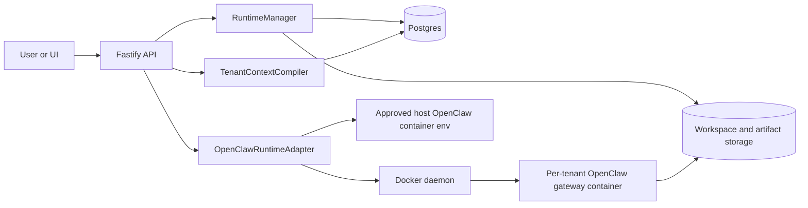
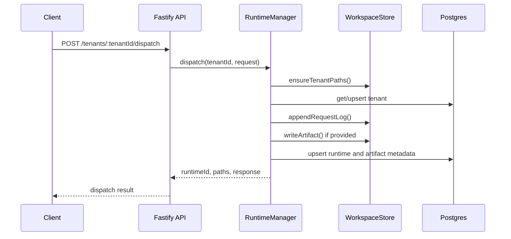
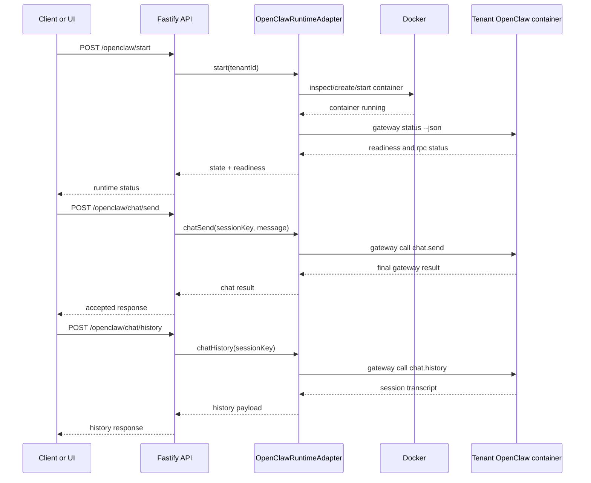

# Session-Based OpenClaw Architecture

This note explains how the `openclaw-session-platform` turns OpenClaw into a
session-based multi-tenant service without treating the tenant runtime itself as
durable state.

The core idea is simple:

- tenant state lives on durable storage and in Postgres
- the OpenClaw gateway container is disposable and can be recreated
- the session experience survives runtime restarts because the platform rebuilds
  execution context from durable state

## What "session-based" means here

Each tenant gets:

- an isolated workspace directory
- an isolated artifact directory
- a logical runtime lease recorded in Postgres
- a dedicated OpenClaw gateway container when interactive chat/runtime access is needed
- one or more OpenClaw chat sessions identified by `sessionKey` inside that tenant runtime

The platform is therefore session-based at two levels:

1. Platform session continuity: the tenant can stop and later resume work from
   persisted workspace, artifacts, and metadata.
2. OpenClaw chat session continuity: the tenant runtime exposes `chat.send` and
   `chat.history` for a named `sessionKey` such as `main`.

## Main components

### Fastify API

The API is the control plane entry point. It exposes:

- tenant lifecycle endpoints such as `/dispatch`, `/status`, and `/stop`
- OpenClaw runtime endpoints such as `/openclaw/start` and `/openclaw/status`
- session chat endpoints such as `/openclaw/chat/send` and `/openclaw/chat/history`
- `/context`, `/metrics`, `/healthz`, and the thin `/ui` console

### RuntimeManager

`RuntimeManager` owns the platform-level in-memory lease for active tenants. It:

- ensures workspace/artifact paths exist
- creates or reuses one active runtime lease per tenant
- writes request logs and artifact metadata
- persists runtime and tenant metadata into Postgres
- stops idle leases through `IdleReaper`

This is not the same thing as the OpenClaw Docker container. It is the
platform's orchestration record for active work.

### PostgresStateStore

Postgres is the durable metadata plane. It stores:

- tenant records
- runtime history and active/stopped status
- artifact manifest metadata

On process boot, the app resets all previously active runtime leases to
`stopped` so it never reports stale in-memory runtime state after a restart.

### WorkspaceStore

The filesystem is the durable content plane. It stores:

- tenant workspace files
- artifact files
- `requests.log` per tenant

### TenantContextCompiler

`TenantContextCompiler` reconstructs the tenant resume payload from durable
state. It combines:

- tenant metadata from Postgres
- artifact metadata from Postgres
- workspace and artifact paths

This is the bridge between durable storage and resumed execution context.

### OpenClawRuntimeAdapter

This adapter manages the real tenant-scoped OpenClaw gateway container. It:

- prepares per-tenant config and workspace directories
- writes a minimal `openclaw.json` if needed
- starts/stops Docker containers named `openclaw-tenant-<tenantId>`
- checks readiness separately from raw container liveness
- forwards approved provider env from the host OpenClaw deployment
- exposes a narrow bridge for allowlisted gateway calls
- exposes first-class chat session operations on top of `chat.send` and `chat.history`

### IdleReaper

`IdleReaper` periodically asks `RuntimeManager` to stop inactive platform leases.
This keeps the orchestration layer ephemeral even when durable tenant state
remains intact.

## End-to-end architecture

## Request flows

### 1. Platform dispatch flow

This is the light orchestration path used by `/tenants/:tenantId/dispatch`.

This flow proves session continuity without requiring the real OpenClaw gateway
container to be running.

### 2. Real OpenClaw session flow

This is the interactive runtime path used by `/openclaw/*`.

## Separation of concerns

The design deliberately separates four concerns that are often mixed together:

### 1. Durable tenant state

Owned by Postgres and the host volume:

- workspace path
- artifact path
- artifact metadata
- request history log
- memory summary
- runtime history metadata

### 2. Platform lease state

Owned by `RuntimeManager` memory plus persisted runtime rows:

- active lease per tenant
- lease timestamps
- idle timeout decisions

### 3. OpenClaw runtime state

Owned by the tenant Docker container:

- container lifecycle
- gateway process lifecycle
- RPC readiness
- in-runtime OpenClaw chat/session state

### 4. Resume context

Owned by `TenantContextCompiler`:

- reconstructs a compact tenant view from durable state
- gives the next runtime enough information to continue work coherently

## Why this works for restart and resume

When `openclaw-session-platform` restarts:

- Postgres metadata stays intact
- workspace and artifact files stay intact
- active runtime leases are marked stopped on boot to remove stale claims
- tenant OpenClaw containers may still be alive because they are separate Docker containers
- the platform can query tenant OpenClaw status again and continue serving session requests

This gives two useful recovery modes:

1. The platform process restarts but tenant container survives.
   Result: session access can resume once the API is back.
2. Both platform process and tenant container stop.
   Result: the next start recreates the OpenClaw container from durable
   workspace/config plus persisted metadata.

## Session boundaries and isolation

Isolation is enforced primarily by tenant-specific paths and containers:

- container name: `openclaw-tenant-<tenantId>`
- config path: `<state>/openclaw-tenants/<tenantId>/config`
- workspace path: `<state>/openclaw-tenants/<tenantId>/workspace`
- platform workspace path: `<data>/workspaces/<tenantId>`
- platform artifact path: `<data>/artifacts/<tenantId>`

Inside a tenant runtime, OpenClaw can host multiple logical conversations via
`sessionKey`. That means:

- tenant isolation happens at container/storage level
- conversation isolation happens at OpenClaw session level

## Important operational detail: liveness is not readiness

The architecture treats Docker state and OpenClaw readiness as different signals.

- Docker `running` only means the container process exists
- OpenClaw `rpc.ok: true` means the gateway is actually ready to serve calls

That is why `/openclaw/status` reports:

- `state`
- `readiness`
- `rpcOk`
- `rpcUrl`
- `readinessDetail`

Without this distinction, the platform would report false positives during warm-up.

## Security and control-plane constraints

The platform does not expose the entire OpenClaw gateway surface. The current
public bridge is intentionally narrow:

- `health`
- `status`
- `system-presence`
- `cron.*`
- dedicated chat routes for `chat.send` and `chat.history`

Provider auth is also controlled centrally. Tenant containers reuse approved
provider env discovered from the host OpenClaw deployment instead of embedding
secrets in repo config.

## Practical summary

If you strip the implementation down to one sentence:

> The platform persists tenant state outside the runtime, then spins up or
> reconnects a tenant-specific OpenClaw gateway container to continue a named
> session on demand.

That is the session-based OpenClaw model implemented in this repository.
